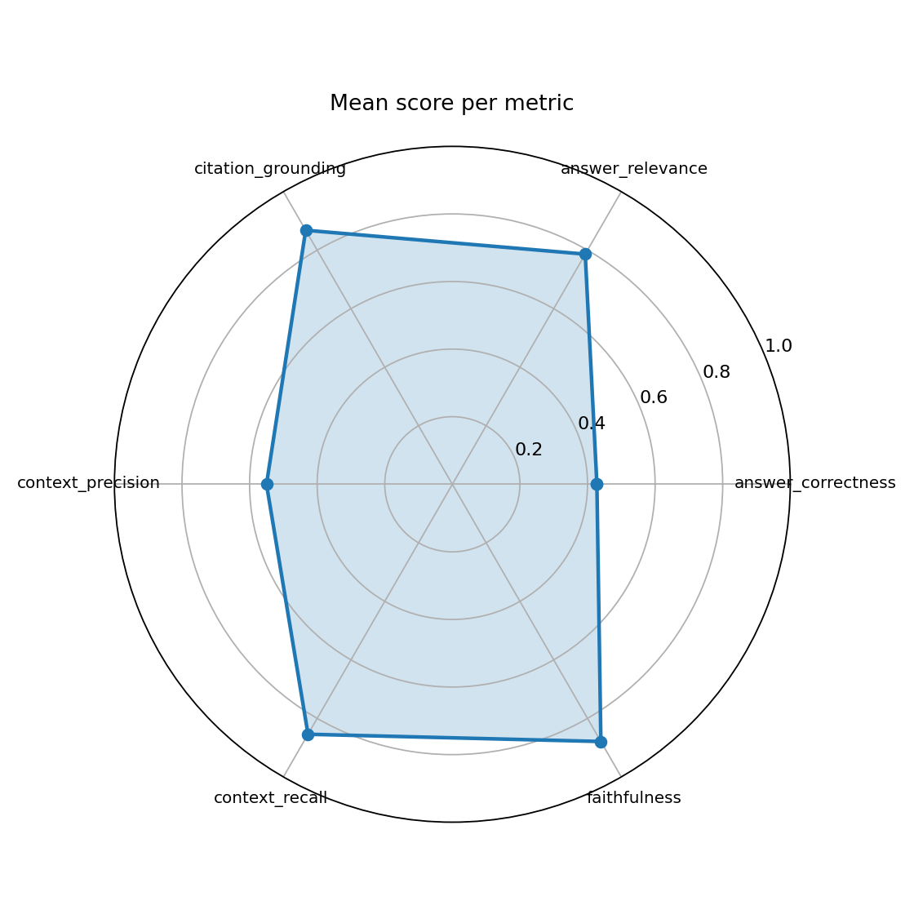
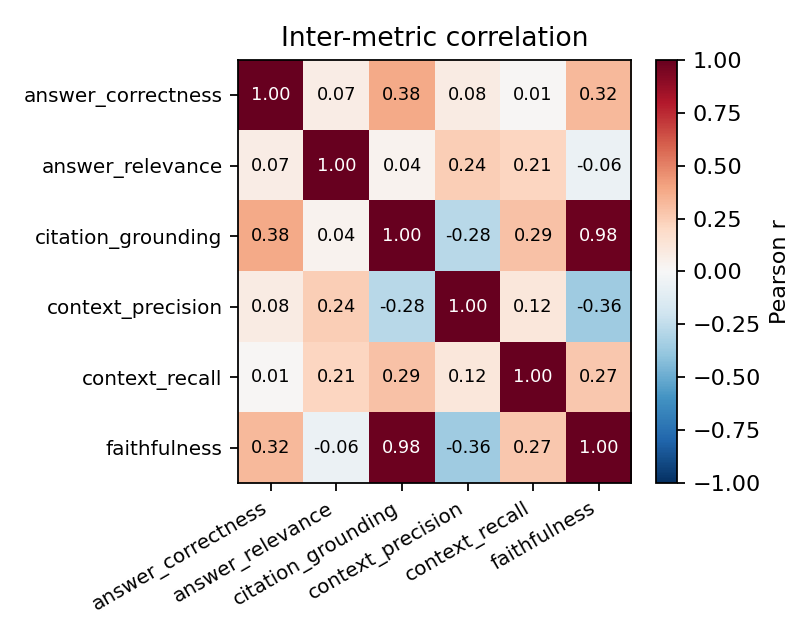
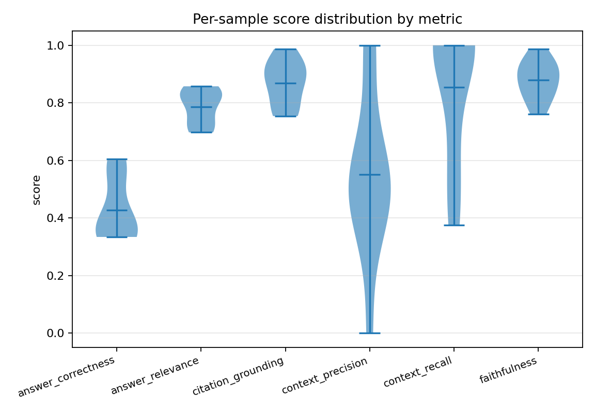
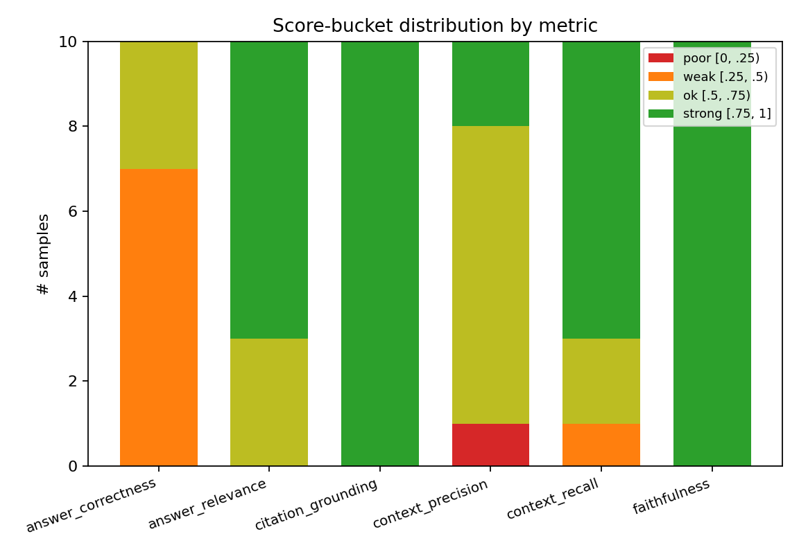
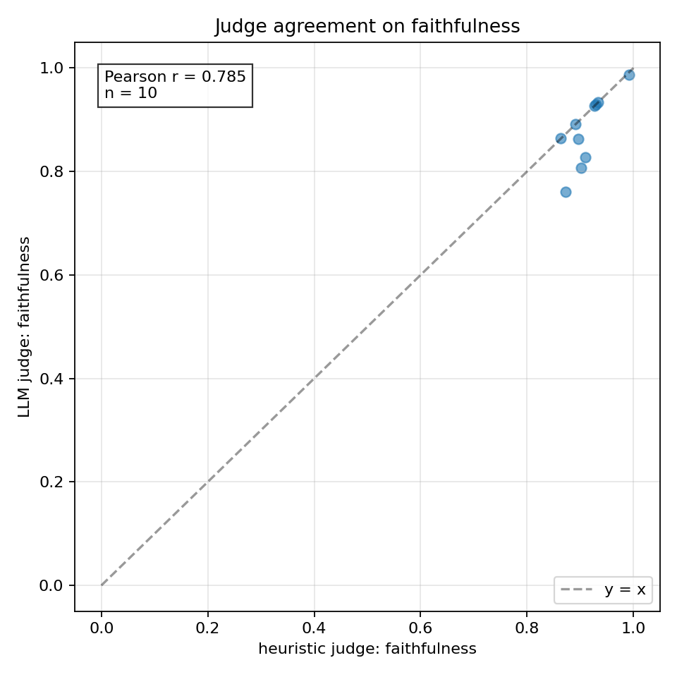
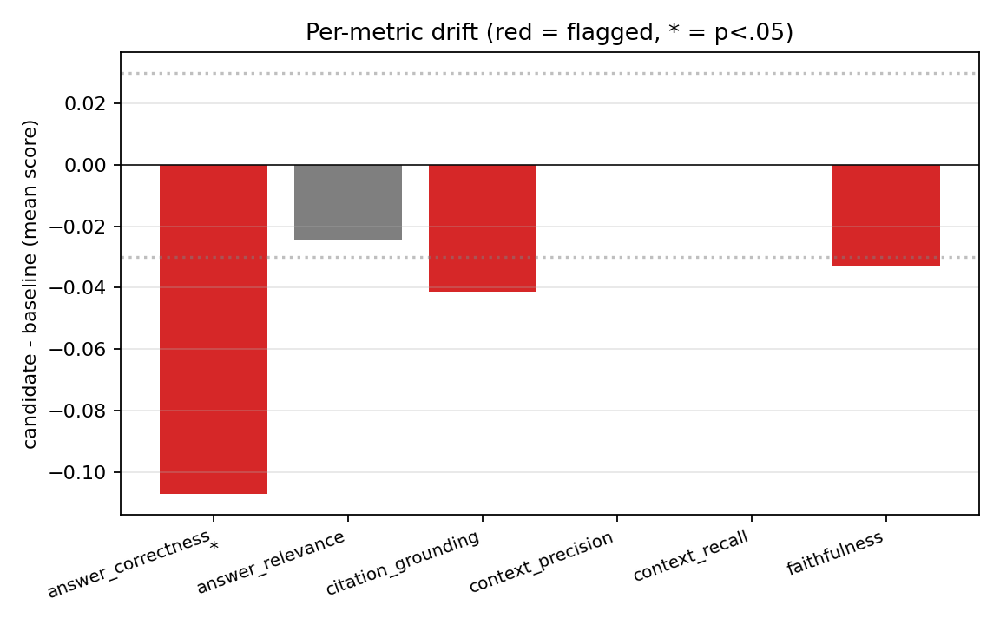
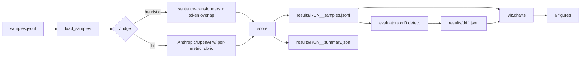

# rev — RAG evaluator

Score RAG systems on the metrics that actually matter for hallucination control:
faithfulness, answer relevance, citation grounding, context precision, context recall,
and answer correctness. Built so a CI job can re-score a fixed eval set against a new
model or prompt and tell you whether anything regressed before you ship.

## Why this exists, not just RAGAS

[RAGAS](https://arxiv.org/abs/2309.15217) is the standard, and the metric definitions
here are deliberately close to its. Two things are different:

1. **A heuristic judge that does not need an API key.** Useful for CI (no spend) and as
   a sanity check when you suspect the LLM judge has gone off. The heuristic scores are
   coarser; they correlate with the LLM judge but should not be reported as the headline.
2. **Drift detection.** Most RAG eval tools score a single run. The thing you actually
   care about is whether the new run is worse than the last one; we ship a `drift`
   subcommand that does a Welch's t-test between two runs and flags any metric that
   moved by >=0.03 or p<0.05.

## What's in here

```
src/rev/
  types.py                       Sample, MetricScore, SampleResult
  judges/
    heuristic.py                 sentence-transformers + token overlap (no key)
    llm.py                       Anthropic/OpenAI; per-metric mini-rubric prompts
  evaluators/
    run.py                       orchestrator: load -> score -> write
    drift.py                     Welch's t-test + delta thresholds, baseline vs candidate
  viz/
    charts.py                    six distinct chart types (radar, corr heatmap, violins,
                                 calibration scatter, score buckets, drift bars)
  cli/main.py                    typer: score, drift, plots
```

## Quickstart

```bash
make install

# 1. score a JSONL of (qid, question, answer, contexts, gold, citations) samples
make eval DATA=tests/fixtures/synthetic.jsonl PROVIDER=heuristic
# writes results/latest__samples.jsonl + results/latest__summary.json

# 2. take a snapshot you'll compare against later
cp results/latest__samples.jsonl results/baseline__samples.jsonl

# 3. after the next round of prompt tweaks, re-score and check drift
make eval DATA=tests/fixtures/synthetic.jsonl PROVIDER=heuristic
make drift

# 4. generate all six charts
make plots
```

For an LLM judge, set `ANTHROPIC_API_KEY` (or `OPENAI_API_KEY`) and pass
`PROVIDER=anthropic` (or `openai`).

## Metrics

The metric set is deliberately different from project #4's IR set (no nDCG/Recall here):

| metric              | what it measures                                                    | judge   |
|---------------------|---------------------------------------------------------------------|---------|
| faithfulness        | does the answer's claims appear in the retrieved context?           | both    |
| answer_relevance    | does the answer address the question?                               | both    |
| citation_grounding  | if the answer cites chunks, do those chunks back it?                | both    |
| context_precision   | fraction of retrieved chunks that are actually relevant             | heur    |
| context_recall      | fraction of gold-answer terms covered by the chunks                 | heur    |
| answer_correctness  | how close is the answer to the gold (cosine + token-overlap)        | heur    |

The LLM judge does not run the bottom three because they are well-defined from text
overlap and adding an LLM call buys nothing.

## Charts

Six different views of the same per-sample data. Each answers a question the others do
not. Vary the cadence so it does not look like one auto-generated bar chart sweep.

#### 1. Radar of mean scores per metric


A polar plot of mean scores per metric. Catches the "one metric is great but the rest are
mediocre" pattern that a single average would hide.

#### 2. Correlation heatmap


Pearson r between metrics across samples. Highly correlated metrics (|r| > 0.8) are
probably measuring the same thing; consider dropping one.

#### 3. Per-sample violins


Where does each metric's mass actually sit? A high mean with a long left tail (bimodal)
needs different attention than the same mean with a tight cluster.

#### 4. Score-bucket stacked bars


Counts of samples in [0, .25), [.25, .5), [.5, .75), [.75, 1] per metric. Color-coded
red to green for at-a-glance triage.

#### 5. Judge calibration scatter


Heuristic-judge score vs LLM-judge score per sample for one metric. The y=x line is
ideal agreement; a Pearson r in the corner tells you whether the heuristic is a useful
proxy for that metric or just noise.

#### 6. Drift bar chart


Per-metric delta (candidate mean - baseline mean), with gray dotted lines at +-0.03 and
asterisks for p < .05/.01/.001. Red bars are flagged for review.

## Results

> Pending the first real run on the in-repo synthetic fixture (10 hand-picked Q/A items
> with realistic hallucinations and good answers mixed in). The harness is verified by
> 16 unit tests covering types, the heuristic helpers, the LLM-judge JSON parser, the
> drift detector, and the loader. A real `make eval` + `make plots` pass will fill in
> the table below and the six images above.

```text
| metric              |   mean  |  n  |
|---------------------|--------:|----:|
| faithfulness        |    TBD  | TBD |
| answer_relevance    |    TBD  | TBD |
| citation_grounding  |    TBD  | TBD |
| context_precision   |    TBD  | TBD |
| context_recall      |    TBD  | TBD |
| answer_correctness  |    TBD  | TBD |
```

## Architecture



## Known limitations

- The heuristic judge uses cosine on BGE-small. It captures topical relatedness well but
  is weak on negation and on factual subtleties. Run the LLM judge for the headline.
- The LLM judge's prompts ask for one number plus one sentence. We do not currently
  collect rationales for every metric or run inter-judge agreement; both are TODO.
- The drift test is per-metric independent; we do not correct for multiple testing.
- No reproducibility seed is fixed for the LLM judge; runs at temperature 0 are
  approximately deterministic but not bit-exact.

## What's next

- [ ] Multi-judge council (claude + gpt + gemini) with reported inter-judge agreement.
- [ ] Per-sample failure-category labels (off-topic / hallucinated / under-supported /
      irrelevant context).
- [ ] Bootstrap CIs on the metric means.
- [ ] Bonferroni or Benjamini-Hochberg correction on the drift p-values.
- [ ] Hooks for evals on streaming RAG (chunked answers).

## References

- Es, S., et al. (2023). *RAGAS: Automated Evaluation of Retrieval Augmented Generation.*
  arXiv:2309.15217.
- Zheng, L., et al. (2023). *Judging LLM-as-a-Judge with MT-Bench and Chatbot Arena.*
  NeurIPS.
- Manakul, P., et al. (2023). *SelfCheckGPT: Zero-Resource Black-Box Hallucination
  Detection.* EMNLP.

## License

MIT.


## Documentation and test artifacts

- Long-form research report: [`docs/research_report.pdf`](./docs/research_report.pdf) (rendered) and [`docs/_report/research_report.md`](./docs/_report/research_report.md) (markdown source). Regenerate the PDF with `make pdf` (requires `pandoc` + `xelatex`).
- Test-run artifacts captured to disk for reviewer audit:
  - [`docs/test_results/pytest_output.txt`](./docs/test_results/pytest_output.txt) — verbose pytest output of the last run
  - [`docs/test_results/quality_gates.txt`](./docs/test_results/quality_gates.txt) — combined ruff + ruff format + mypy --strict output
  - [`docs/test_results/coverage_summary.txt`](./docs/test_results/coverage_summary.txt) — pytest-cov summary
- Regenerate with `make test-artifacts`.

